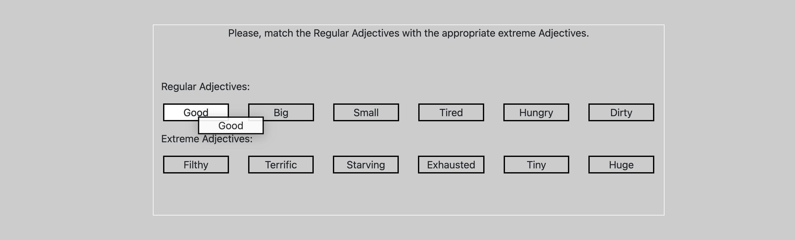

# Drag-n-Drop
 
In the Drag and Drop project, user adjectives will match each other. To do this, the regular adjective draggable=true; We give it the property and we give the adjective Extreme a drop property so that it can make the right match. Since we do this separately for each adjective, there will be no mismatches.
 

 

 

 
After the drop event, display=none; We have given the property and changed the background color so that it correctly writes the adjective regular and extreme with innerHTML to the dropped element and shows that the process is finished.
